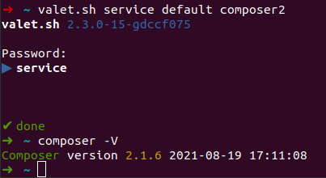

---
hide:
- footer
---

# Composer

Composer is optional and not installed by default - install it via *[install](../commands/install.md)*:
```bash
valet.sh install composer2
```

!!! Info
    Composer 1 has been removed - only Composer 2 is available.

## Versions

|Version|Path|
|-------|-----|
|composer2.x|/usr/local/bin/composer2|

{ align=left }