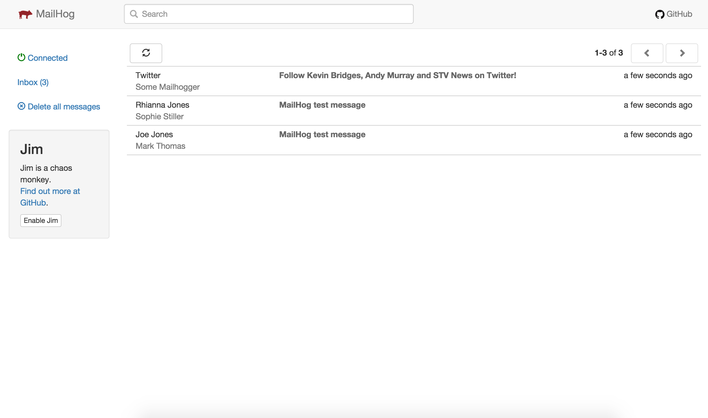

---
hide:
- footer
---

# Mailpit

!!! Quote
    "An email and SMTP testing tool with API for developers" - please visit *[https://github.com/axllent/mailpit](https://github.com/axllent/mailpit)* for more information.

!!! Information
    Mailpit is part of the essential baseline stack and always installed - it cannot be uninstalled.

## Usage

You can access the UI via *[https://mailpit.test](https://mailpit.test)*

PHP is configured to use mailpit automatically (e.g. the mail() function), but you can also connect directly via SMTP.

Mailpit runs in a container on both operating systems. On Ubuntu, Podman is used with the host network, so it stays
reachable via `127.0.0.1` and its port. On macOS, it runs as an Apple container with its own IP address and is
reachable via its DNS name in the `.vsh` domain, using the same port.

| Protocol | Ubuntu | macOS |
|----------|--------|-------|
| HTTP (UI) | 127.0.0.1:8025 | vsh-mailpit.vsh:8025 |
| SMTP      | 127.0.0.1:1025 | vsh-mailpit.vsh:1025 |

{ align=left }
